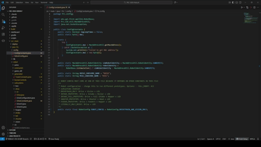

# Introduction {#introduction}

Welcome to the FRC Programming! This is a basic guide that hopefully teaches not just how to write FRC code, but how to write good code in general.

**However, do keep in mind all of the style and organizational things I mention are my personal opinions so please modify it to your liking.**

Most programming guides cover the basics/concepts of how to write FRC code like how to run a motor and how PID works, but this is only a part of what programming is about. This guide will cover these topics, but also tools like how to properly use Git, how to organize your code to be more readable, and the FRC specifics about programming. Hopefully this should make your experience during season a little better as the rest of the team gives you 3 days with the robot!

## Prerequisites {#prereqs}

You should have the latest stable version of WPILib installed (I will try my best to keep everything up to date) but otherwise, none! While I do recommend you to look at other resources for learning Java as they will teach you a lot of the weird quirks of Java, a lot of those resources are boring as hell. In my opinion, doing something is always the best way to learn, not just following a guide. So even if you have no clue what you're doing, dive right into it and either sink or swim. This guide is simply supposed to help provide some sort of structure in how things are suppoed to look and operate.

## How to use this Website {#user-guide}

I mentioned this above, but this guide is meant to provide a structure to how your code should look roughly. You are the one still making most of the project. Thus, this website was made with the intent with being viewed inside of VS Code (or whatever IDE you prefer) with the integrated browser. This way, you can code while viewing this guide in a small panel so you don't need to switch windows constantly.

If you're just using this as a reference to check on some stuff, this website does have a nav bar on the left side of the page, just hover over and click on which section you want to go to.

If you don't have access to a robot while programming, don't worry! FRC has simulation built into it. You can follow all the modules within this guide through your simulation — I recommend everyone reading this to do this actually since simulation is a lot faster than deploying code.

Since you have access to simulation, don't be afraid to experiment with things. Once you create your first subsystem, try to implement the second one without looking at a guide. Maybe try figuring out how to create an flywheel or some sort of wacky subsystem. Again, learning FRC (and programming really) is a lot of just trying stuff and seeing how it works, so try out new stuff if you want to learn.

## Some Notes {#extra-notes}
I currently have not written anything about REV hardware since my team does not use them. If you're interested in helping fix that gap in this guide, please let me know at thomasahn2009@gmail.com!